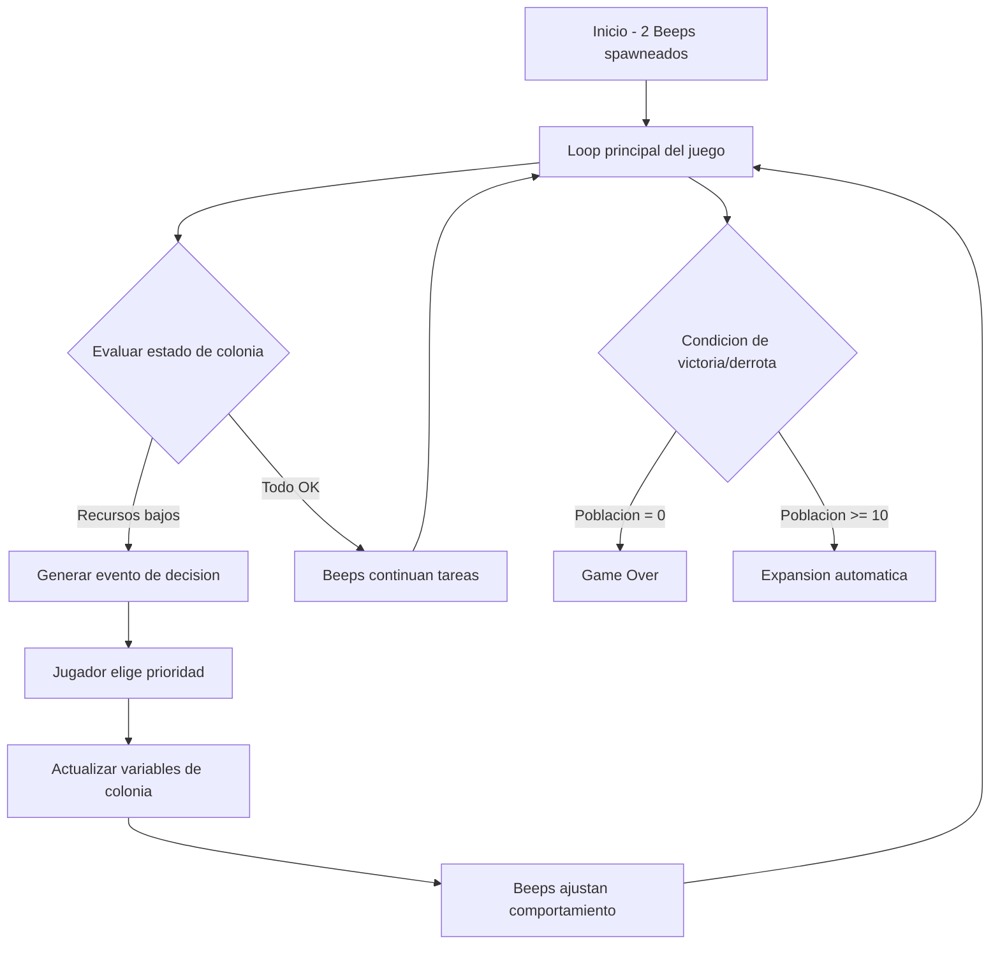

# CiviliSim - Arquitectura y Plan de Desarrollo MVP1

## Visión General

Colony/Civilization sim 2D pixel art donde el jugador guía la civilización mediante decisiones estratégicas, mientras los "Beeps" (agentes autónomos) ejecutan la vida diaria usando Behavior Trees.

**Motor:** Godot 4.x
**Lenguaje:** GDScript (lógica general) + C# (performance crítica)
**Alcance:** MVP1 únicamente

---

## Arquitectura del Proyecto

```
CiviliSim/
├── project.godot
├── icon.svg
├── addons/
├── scenes/
│   ├── main/
│   │   ├── main.tscn              # Scene principal del juego
│   │   └── Main.gd
│   ├── world/
│   │   ├── world.tscn             # Mundo 2D tileado
│   │   └── World.gd
│   ├── beep/
│   │   ├── beep.tscn              # Sprite del Beep
│   │   └── BeepAgent.gd           # Controlador del agente
│   ├── buildings/
│   │   ├── building.tscn          # Edificio base
│   │   ├── shelter.tscn           # Refugio (único edificio MVP1)
│   │   └── Building.gd
│   ├── resources/
│   │   ├── resource_node.tscn     # Nodo de recurso (comida, madera, piedra)
│   │   └── ResourceNode.gd
│   └── ui/
│       ├── hud.tscn               # Interfaz principal
│       ├── decision_panel.tscn    # Panel de decisiones
│       └── GameUI.gd
├── scripts/
│   ├── core/                      # C# - Performance crítica
│   │   ├── BehaviorTree.cs        # Motor de Behavior Trees
│   │   ├── BehaviorNode.cs        # Nodo base del árbol
│   │   ├── GameSimulator.cs       # Simulación del juego (física, colisiones)
│   │   └── Pathfinding.cs         # Pathfinding en grid
│   ├── systems/
│   │   ├── colony_manager.gd      # Gestiona el estado de la colonia
│   │   ├── resource_manager.gd    # Gestiona recursos globales
│   │   ├── decision_system.gd     # Sistema de decisiones del jugador
│   │   ├── spawn_manager.gd       # Spawnea recursos y Beeps
│   │   └── reproduction_system.gd # Sistema de reproducción
│   ├── agents/
│   │   ├── beep_stats.gd          # Estadísticas del Beep
│   │   ├── beep_behavior.gd       # Behavior Tree del Beep (GDScript wrapper)
│   │   └── beep_actions.gd        # Acciones disponibles
│   └── data/
│       ├── game_config.gd         # Configuración global
│       ├── resource_types.gd      # Definición de recursos
│       └── building_types.gd      # Definición de edificios
├── assets/
│   ├── tiles/
│   │   ├── ground_tileset.png
│   │   ├── ground_tileset.png.import
│   │   └── tileset.tres
│   ├── sprites/
│   │   ├── beep_sprite.png
│   │   ├── resource_food.png
│   │   ├── resource_wood.png
│   │   ├── resource_stone.png
│   │   └── shelter_sprite.png
│   ├── ui/
│   │   ├── button_style.tres
│   │   └── panel_style.tres
│   └── fonts/
│       └── game_font.tres
└── README.md
```

---

## Componentes Clave

### 1. Sistema de Recursos Globales

```
ResourceState {
  comida: float        # Unidades de comida disponibles
  madera: float        # Unidades de madera
  piedra: float        # Unidades de piedra
  poblacion: int       # Cantidad de Beeps vivos
  felicidad: float     # 0-100
  salud_promedio: float # 0-100
  orden_social: float  # 0-100
}
```

### 2. Agente Beep

Cada Beep tiene:

```
BeepStats {
  hambre: float         # 0-100, aumenta con el tiempo
  energia: float       # 0-100, disminuye al trabajar
  salud: float         # 0-100
  edad: float          # En ticks del juego
  estado_actual: Enum  # idle, working, eating, resting, moving
  tarea_asignada: Task # Tarea actual del Behavior Tree
}
```

### 3. Behavior Tree (C# - Performance Crítica)

```
BehaviorTree
├── Selector (prioridad descendente)
│   ├── Sequence: Hambre > 70
│   │   ├── Action: BuscarComida()
│   │   └── Action: Comer()
│   ├── Sequence: Energía < 20
│   │   ├── Action: BuscarRefugio()
│   │   └── Action: Descansar()
│   ├── Sequence: Salud < 30
│   │   └── Action: BuscarRefugio()
│   ├── Sequence: PrioridadColonia == Comida && Energía > 40
│   │   └── Action: RecolectarComida()
│   ├── Sequence: PrioridadColonia == Construccion && Energía > 40
│   │   └── Action: Construir()
│   ├── Sequence: PrioridadColonia == Exploracion && Energía > 60
│   │   └── Action: Explorar()
│   └── Sequence: Sin tarea urgente
│       └── Action: ComportamientoAleatorio()
```

### 4. Sistema de Decisiones del Jugador

Cada X segundos (o tras eventos), el jugador elige:

```
DecisionEvent {
  tipo: Enum           # resource_shortage, population_growth, disaster, etc.
  descripcion: String
  opciones: Array[DecisionOption]
  urgencia: float      # 0-1, afecta el tiempo para responder
}

DecisionOption {
  id: String
  texto: String
  efectos: Dictionary  # Modificaciones a variables del juego
}
```

### 5. Mapa 2D Tileado

- TileMap de Godot con capas:
  - **Terreno:** Pasto, agua, montaña
  - **Recursos:** Nodos de comida, madera, piedra
  - **Edificios:** Refugios construidos
  - **Pathfinding:** Grid para navegación

---

## Flujo del Juego



---

## Plan de Desarrollo - MVP1

### Fase 1: Fundamentos del Motor

- Configurar proyecto Godot 4.x con C#
- Crear estructura de carpetas
- Configurar TileMap básico con terreno
- Implementar cámara con zoom y pan

### Fase 2: Sistema de Recursos

- Implementar ResourceNode (comida, madera, piedra)
- Script para spawneado procedural de recursos
- Resource Manager global para tracking

### Fase 3: El Beep - Agente Básico

- Crear sprite y animaciones básicas del Beep
- Implementar BeepStats (hambre, energía, salud)
- Movimiento básico con pathfinding en grid

### Fase 4: Behavior Tree Engine (C#)

- Implementar motor de Behavior Trees en C#
- Crear nodos base: Selector, Sequence, Action, Condition
- Implementar el árbol de comportamiento del Beep
- Conectar con prioridades de la colonia

### Fase 5: Acciones del Beep

- Recolectar recursos
- Comer
- Descansar en refugio
- Construir refugio

### Fase 6: Edificios

- Crear Building base
- Implementar Refugio (shelter)
- Sistema de construcción por Beeps

### Fase 7: Sistema de Decisiones

- Panel UI para decisiones
- Generador de eventos de decisión
- Sistema de efectos sobre variables globales

### Fase 8: Reproducción Básica

- Sistema de apareamiento
- Spawn de nuevo Beep
- Límite de población basado en recursos

### Fase 9: HUD y UI

- Barra de recursos globales
- Indicadores de estado del Beep (al hacer click)
- Panel de decisiones integrado

### Fase 10: Pulido y Balanceo

- Balancear valores de recursos y consumo
- Ajustar tiempos de decisiones
- Debug y testing

---

## Consideraciones Técnicas

### GDScript vs C#

| Componente | Lenguaje | Razón |
|------------|----------|-------|
| Behavior Tree Engine | C# | Performance, muchos agentes evaluando árboles |
| Pathfinding | C# | Cálculos intensivos en grid |
| Game Simulator | C# | Loop de simulación global |
| UI / HUD | GDScript | Interacción nativa con Godot nodes |
| Colony Manager | GDScript | Lógica de juego, no performance crítica |
| Beep Agent Controller | GDScript | Bridge entre GDScript y C# |
| Resource Manager | GDScript | Operaciones simples de datos |

### Performance

- Usar Object Pooling para Beeps y recursos
- Behavior Tree evaluado en intervalos, no cada frame
- Pathfinding con A* optimizado en C#
- Culling de agentes fuera de cámara

### Datos Persistentes

- Guardar estado de colonia en JSON
- Checkpoint automático cada X minutos
- Configurable en opciones

---

## Roadmap Post-MVP1 (Referencia)

### MVP2
- Granjas y almacenes
- Roles especializados
- Enfermedad y clima
- Crianza de Beeps jóvenes

### Civilization Layer
- Cultura y leyes
- Tecnología
- Religión/creencias
- Comercio y guerra
